# FlashCard

A bilingual Persian/English Leitner flashcard application built with Laravel 12, Vue 3, Tailwind CSS, and Vite.

## Features

- Persian and English UI with automatic RTL/LTR switching
- Language preference stored in the browser
- Nested flashcard categories and per-user access control
- Configurable Leitner study steps and due-card tracking
- Multi-sided cards with image and audio uploads
- Single and bulk card creation
- Optional OpenAI-assisted English vocabulary cards, images, and pronunciation audio
- User, role, profile, and category-access management
- Installable PWA manifest and service worker

## Screenshots

### Desktop — Persian / Dark

<table>
  <tr>
    <td align="center"><strong>ورود</strong></td>
    <td align="center"><strong>دسته‌ها</strong></td>
  </tr>
  <tr>
    <td>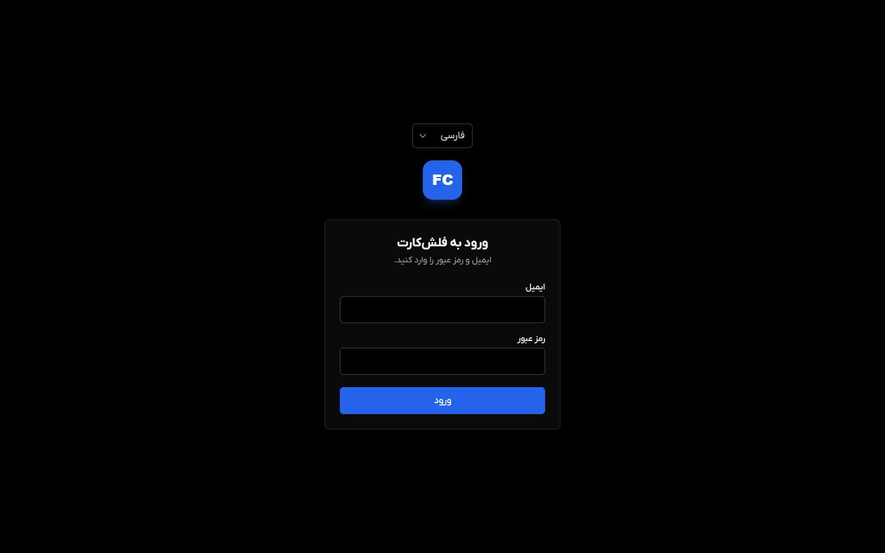</td>
    <td>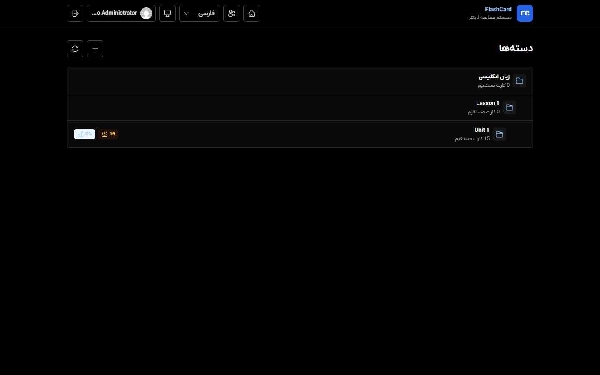</td>
  </tr>
  <tr>
    <td align="center"><strong>گام‌های لایتنر</strong></td>
    <td align="center"><strong>جلسه مطالعه</strong></td>
  </tr>
  <tr>
    <td>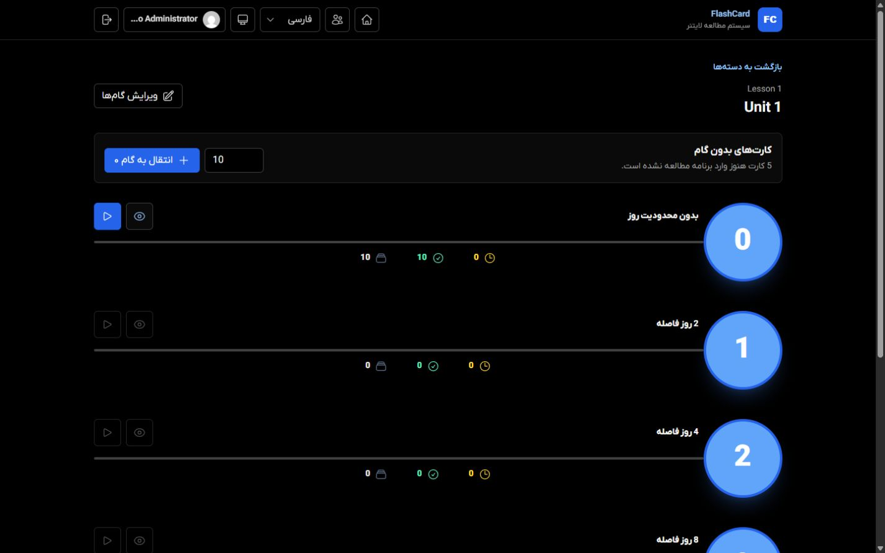</td>
    <td>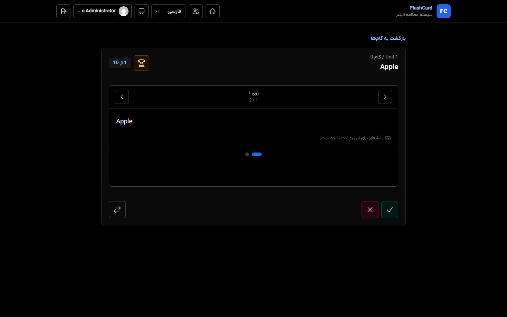</td>
  </tr>
</table>

### Desktop — English / Light

<table>
  <tr>
    <td align="center"><strong>Login</strong></td>
    <td align="center"><strong>Category overview</strong></td>
  </tr>
  <tr>
    <td>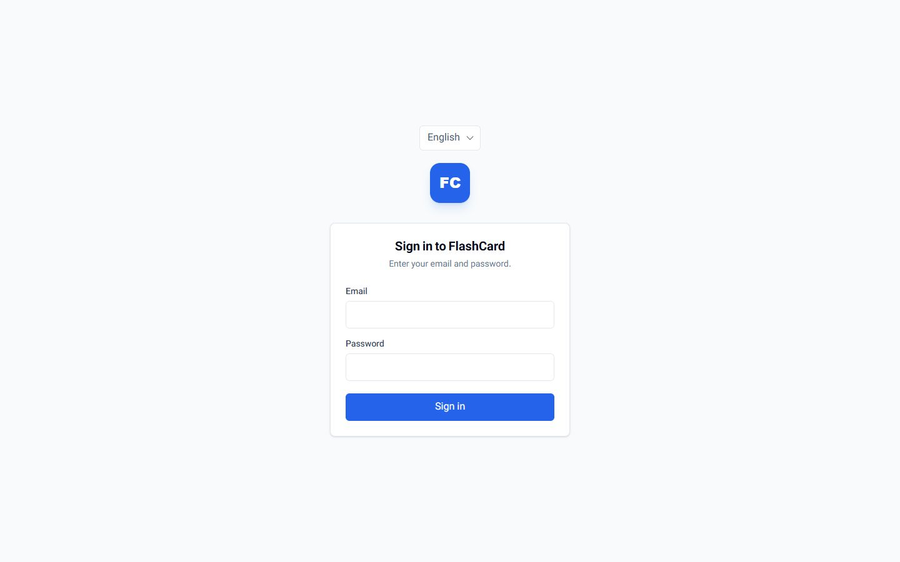</td>
    <td>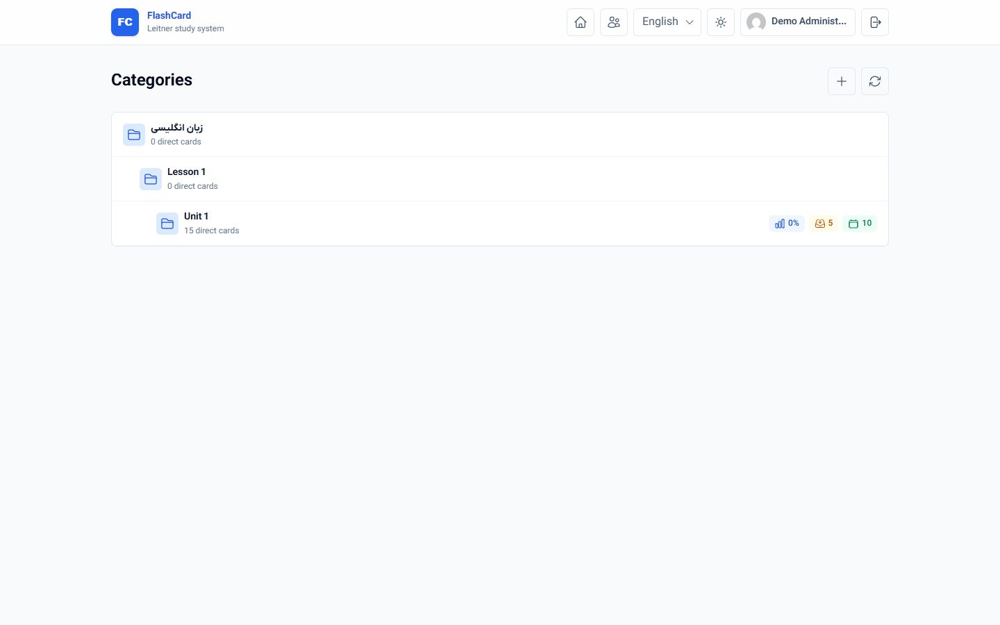</td>
  </tr>
  <tr>
    <td colspan="2" align="center"><strong>Study session</strong></td>
  </tr>
  <tr>
    <td colspan="2" align="center">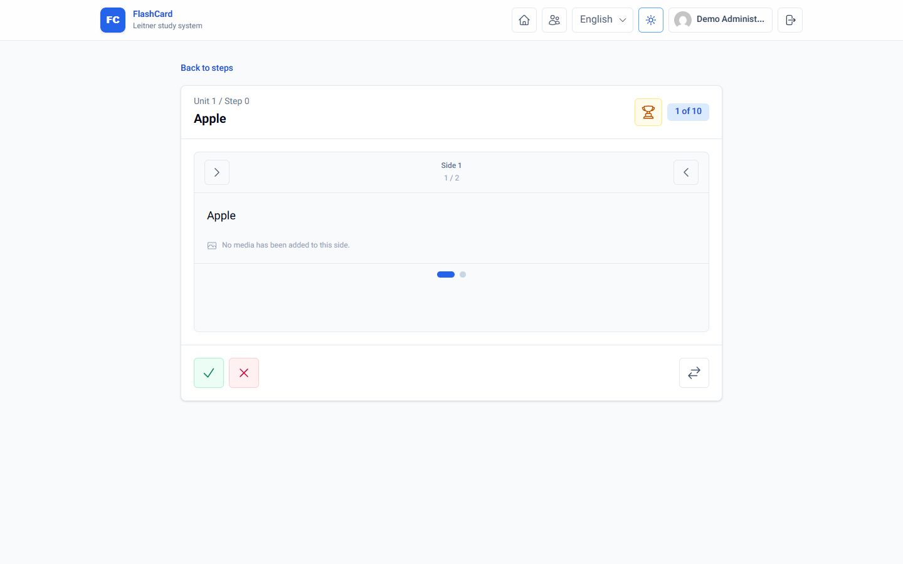</td>
  </tr>
</table>

### Mobile — Persian / Dark

<table>
  <tr>
    <td align="center"><strong>ورود</strong></td>
    <td align="center"><strong>دسته‌ها</strong></td>
    <td align="center"><strong>گام‌ها</strong></td>
    <td align="center"><strong>مطالعه</strong></td>
  </tr>
  <tr>
    <td>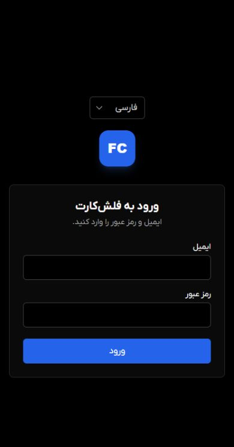</td>
    <td>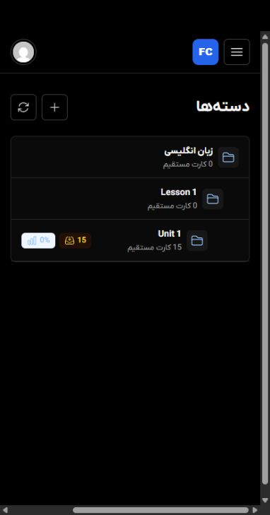</td>
    <td>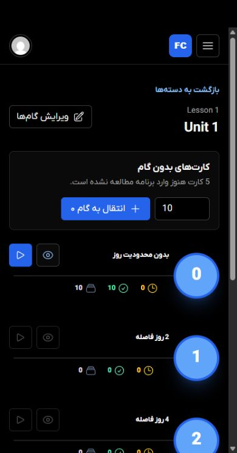</td>
    <td>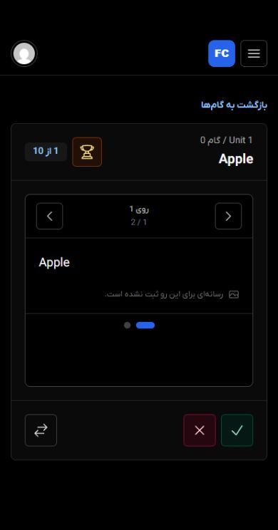</td>
  </tr>
</table>

## Requirements

- PHP 8.2 or newer
- Composer 2
- Node.js 22
- pnpm 11
- SQLite, MySQL, PostgreSQL, or another database supported by Laravel
- A scheduler process when smart-card processing is enabled

## Local setup

```bash
git clone https://github.com/KHSilent/Flashcards-LeitnerBox.git
cd FlashCard
composer install
pnpm install --frozen-lockfile
cp .env.example .env
php artisan key:generate
```

Configure the database in `.env`. For SQLite, create `database/database.sqlite` and set:

```dotenv
DB_CONNECTION=sqlite
DB_DATABASE=/absolute/path/to/database/database.sqlite
```

Then initialize the application:

```bash
php artisan migrate
php artisan storage:link
pnpm run build
```

### Create the first administrator

There is intentionally no hard-coded default password. Set these values in `.env` before seeding:

```dotenv
SEED_ADMIN_NAME="Administrator"
SEED_ADMIN_EMAIL="admin@example.com"
SEED_ADMIN_PASSWORD="use-a-long-random-password"
SEED_DEMO_DATA=false
```

Then run:

```bash
php artisan db:seed
```

Set `SEED_DEMO_DATA=true` only if you also want the sample English vocabulary deck.

## Development

Run Laravel and Vite separately:

```bash
php artisan serve
pnpm run dev
```

Or use the bundled Composer command, which also starts the scheduler and application log viewer:

```bash
composer run dev
```

## Optional OpenAI processing

Add an API key to `.env`:

```dotenv
OPENAI_API_KEY=
OPENAI_BASE_URL=https://api.openai.com/v1
OPENAI_TEXT_MODEL=gpt-4.1-mini
OPENAI_IMAGE_MODEL=gpt-image-1-mini
OPENAI_TTS_MODEL=gpt-4o-mini-tts
OPENAI_TTS_VOICE=marin
```

Queued smart cards are processed by Laravel's scheduler. In production, run the standard scheduler cron entry:

```cron
* * * * * cd /path/to/FlashCard && php artisan schedule:run >> /dev/null 2>&1
```

## Tests and checks

```bash
php artisan test
vendor/bin/pint --test
pnpm run build
pnpm audit --prod
```

## Production checklist

1. Point the web server document root to the `public` directory.
2. Set `APP_ENV=production`, `APP_DEBUG=false`, and the correct HTTPS `APP_URL`.
3. Use a unique `APP_KEY` and never commit the production `.env` file.
4. Set `SESSION_SECURE_COOKIE=true` when serving over HTTPS.
5. Configure a production database, mail/log drivers, backups, and file permissions.
6. Run `composer install --no-dev --optimize-autoloader` and `pnpm install --frozen-lockfile && pnpm run build`.
7. Run `php artisan migrate --force`, `php artisan storage:link`, and `php artisan optimize`.
8. Configure Laravel's scheduler if smart processing is used.
9. Ensure `storage` and `bootstrap/cache` are writable by the application user.

## Security

- Authentication uses Laravel's session and CSRF protection.
- Login attempts are rate-limited.
- API authorization is enforced per user, role, and category.
- Uploaded SVG files are rejected to avoid stored script execution.
- Managed uploads are deleted when cards are updated or removed.
- Basic browser security headers are applied by the application.

Please report security issues privately rather than opening a public issue.

## License

This project is licensed under the [MIT License](LICENSE).
